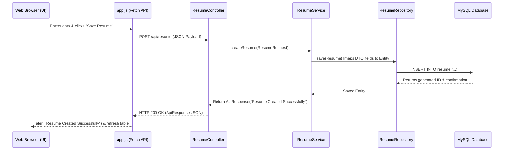

# Resume Builder Application

A full-stack Resume Builder web application built with **Spring Boot (Java)** for the backend REST API, **MySQL** as the relational database, and a clean **HTML / CSS / JavaScript** frontend. 

This repository serves as a reference template for building user and resume management systems.

---

## 🛠️ Technologies Used

### Backend
* **Java 21**: The programming language for backend development.
* **Spring Boot 4.1.0**: Framework used to build the REST API endpoints and manage application components.
  * **Spring Web**: Handles HTTP request parsing and response mapping (Web MVC).
  * **Spring Data JPA & Hibernate**: Object-Relational Mapping (ORM) to interact with the database.
  * **Spring Boot Validation**: Ensures correct data request structures (e.g., in DTOs).
  * **Spring Boot Actuator**: Provides application health checks and metrics.
  * **Lombok**: Annotation-based tool to automatically generate boilerplates like getters, setters, constructors, and builder patterns.
* **Maven**: Dependency management and build tool.

### Database
* **MySQL 8.x**: Relational database storage.

### Frontend (Static Web Content)
* **HTML5**: Defines the structure of the dashboard and authorization pages.
* **CSS3**: Styles the web application using a modern, clean, and responsive design (Vanilla CSS).
* **JavaScript**: Performs asynchronous API requests (`fetch`) to communicate with the Spring Boot backend without page reloads.

---

## 📁 Project Folder Structure

Below is the directory tree of the project with details of key folders:

```text
resume/
│
├── .mvn/                             # Maven wrapper configuration folder
├── .vscode/                          # VS Code environment configurations
├── mvnw                              # Maven Wrapper script (Linux/macOS)
├── mvnw.cmd                          # Maven Wrapper script (Windows)
├── pom.xml                           # Maven project build configuration & dependencies
├── HELP.md                           # Default Spring Boot getting started guide
│
└── src/
    ├── main/
    │   ├── java/com/api/resume/      # Java source code root
    │   │   ├── controller/           # REST Controllers (exposing HTTP endpoints)
    │   │   ├── dto/                  # Data Transfer Objects for network payloads
    │   │   │   ├── request/          # Client request structures (Login, Register, Resume)
    │   │   │   └── response/         # Server response structures (ApiResponse, ResumeResponse)
    │   │   ├── entity/               # JPA Database entities representing database schemas
    │   │   ├── repository/           # Spring Data JPA Repository interfaces for database actions
    │   │   ├── service/              # Service layer implementing core business logic
    │   │   └── ResumeApplication.java # The main class to launch the Spring Boot app
    │   │
    │   └── resources/
    │       ├── static/               # Client-side static UI assets (HTML, CSS, JS, Images)
    │       └── application.properties # Application configurations (port, DB details, logging)
    │
    └── test/
        └── java/com/api/resume/      # Test suite root (Unit and integration tests)
```

---

## 📄 Details of All Project Files

### 1. Build and Configurations
* **[pom.xml](pom.xml)**: The central Maven build file. It defines the Spring Boot starter parent version, the target Java version (21), and imports all dependencies such as `spring-boot-starter-webmvc`, `spring-boot-starter-data-jpa`, `lombok`, `mysql-connector-j`, and the testing libraries.
* **[application.properties](src/main/resources/application.properties)**: Configures server settings (running on port `8080`), database URL (`jdbc:mysql://localhost:3306/resume_builder`), username, password, and configures Hibernate to show SQL commands and auto-update the schema structure (`ddl-auto=update`).

### 2. Main Entry Point
* **[ResumeApplication.java](src/main/java/com/api/resume/ResumeApplication.java)**: The bootstrapper file annotated with `@SpringBootApplication` that starts the Spring container and runs the embedded Apache Tomcat web server.

### 3. JPA Entities (Database Tables Schema)
* **[User.java](src/main/java/com/api/resume/entity/User.java)**: Represents the `User` database table containing columns `id`, `name`, `email`, and `password`. Uses Lombok's `@Data` to auto-generate getters and setters.
* **[Resume.java](src/main/java/com/api/resume/entity/Resume.java)**: Represents the `Resume` database table, recording columns `id`, `userId` (representing the owner), `fullName`, `phone`, `address`, `education`, `skills`, and `experience`.

### 4. Repositories (Data Access Layer)
* **[UserRepository.java](src/main/java/com/api/resume/repository/UserRepository.java)**: Interfaces with the `User` database table. Includes a custom lookup method `findByEmail(String email)` to locate registered users.
* **[ResumeRepository.java](src/main/java/com/api/resume/repository/ResumeRepository.java)**: Interfaces with the `Resume` database table. Includes a search query `findBySkillsContaining(String skill)` to filter resumes by a specific technology or keyword.

### 5. Data Transfer Objects (DTOs)
* **[RegisterRequest.java](src/main/java/com/api/resume/dto/request/RegisterRequest.java)**: Payload model for sending registration details (`name`, `email`, `password`) to the backend.
* **[LoginRequest.java](src/main/java/com/api/resume/dto/request/LoginRequest.java)**: Payload model for sending login credentials (`email`, `password`).
* **[ResumeRequest.java](src/main/java/com/api/resume/dto/request/ResumeRequest.java)**: Payload model for sending resume details to create or update.
* **[ApiResponse.java](src/main/java/com/api/resume/dto/response/ApiResponse.java)**: Simple standard wrapper representing text messages sent back to the client.
* **[ResumeResponse.java](src/main/java/com/api/resume/dto/response/ResumeResponse.java)**: Response structure representing a structured resume record.

### 6. Services (Business Logic Layer)
* **[UserService.java](src/main/java/com/api/resume/service/UserService.java)**: Coordinates user functionalities:
  * `register()`: Inserts a new user record.
  * `login()`: Validates request credentials against the repository collection.
  * `getAllUsers()`: Retrieves all registered users from the database.
* **[ResumeService.java](src/main/java/com/api/resume/service/ResumeService.java)**: Implements CRUD logic on resumes:
  * `createResume()`: Validates and saves a new resume.
  * `getAllResumes()`: Fetches all resumes.
  * `getResumeById()`: Fetches a single resume.
  * `updateResume()`: Modifies existing values of a resume ID.
  * `deleteResume()`: Removes a resume by ID.

### 7. Controllers (REST API Handlers)
* **[AuthController.java](src/main/java/com/api/resume/controller/AuthController.java)**: Exposes endpoints for auth routines (`/api/auth/register` and `/api/auth/login`). Annotations like `@CrossOrigin("*")` allow backend accessibility from different frontends.
* **[UserController.java](src/main/java/com/api/resume/controller/UserController.java)**: Exposes a `/api/users` endpoint to list user records.
* **[ResumeController.java](src/main/java/com/api/resume/controller/ResumeController.java)**: Exposes `/api/resume` CRUD endpoints supporting HTTP POST, GET, PUT, and DELETE methods.

### 8. Frontend Assets
* **[index.html](src/main/resources/static/index.html)**: The landing homepage showcasing the application features and providing links to register or login.
* **[register.html](src/main/resources/static/register.html)**: Form to record new user credentials.
* **[login.html](src/main/resources/static/login.html)**: Form to authenticate users.
* **[resume.html](src/main/resources/static/resume.html)**: The primary dashboard interface. Contains panel grids for adding/updating details, a dynamic list table, and views/deletions tools.
* **[users.html](src/main/resources/static/users.html)**: Admin-like dashboard displaying all users and high-level stats cards (active status, technology used, etc.).
* **[app.js](src/main/resources/static/app.js)**: Contains AJAX fetch routines mapping UI button click actions directly to REST API requests. Handles alert messages and page redirects.
* **[style.css](src/main/resources/static/style.css)**: Shared styling rules governing inputs, buttons, tables, and page alignments.

---

## 🔄 Application Workflow & Backend Connectivity

This project utilizes a **layered architecture** (commonly referred to as a **3-tier architecture**) to isolate responsibilities across components:
1. **Presentation Layer (Frontend)**: Static files (HTML, CSS, JS) served from the resources directory.
2. **Controller Layer (API Gateway)**: Handles REST requests, maps endpoints, and processes request payloads.
3. **Service Layer (Business Logic)**: Coordinates business rules, validation, and mappings.
4. **Repository Layer (Data Access)**: JPA repositories communicating with the MySQL database via JDBC.

### 1. Data Flow (Step-by-Step Example: Creating a Resume)
The sequence diagram below shows how a client request flows through the system components:



### 2. Backend Database Connectivity
* **Database Driver**: The project includes the MySQL Connector dependency (`mysql-connector-j`) which enables Java Database Connectivity (JDBC) to link to a MySQL instance.
* **Hibernate/JPA (ORM)**: Instead of writing manual raw SQL queries (like `SELECT * FROM ...`), the application uses **Spring Data JPA**. Under the hood, **Hibernate** translates Java objects (e.g., `Resume.java`) into SQL tables and queries.
* **Connection Lifecycle**:
  - When the application boots, Spring Boot reads database configuration from `application.properties`.
  - It creates a connection pool datasource.
  - Hibernate executes DDL scripts (e.g., `CREATE TABLE IF NOT EXISTS...`) to align database tables with JPA `@Entity` Java classes.
  - During HTTP requests, transaction managers lease connections, perform transactions via `.save()`, `.findAll()`, etc., and commit changes.

### 3. Frontend-Backend Interconnection
* **Direct Server Hosting**: Spring Boot uses an embedded Tomcat server. When the server is active, anything placed in the `src/main/resources/static/` directory is automatically served as static web pages under the root url (`http://localhost:8080`).
* **AJAX fetch Requests**:
  - In `app.js`, a constant `BASE_URL` is set to `http://localhost:8080`.
  - When a form is submitted (e.g., `register()`), JavaScript reads the input fields, bundles them into a JavaScript object, serializes it to a JSON string using `JSON.stringify(user)`, and sends it as the body of an HTTP POST request:
    ```javascript
    fetch(BASE_URL + "/api/auth/register", {
        method: "POST",
        headers: { "Content-Type": "application/json" },
        body: JSON.stringify(user)
    });
    ```
  - The controller receives this JSON payload, deserializes it into the Java DTO object `RegisterRequest`, processes it, and returns an `ApiResponse` object which gets serialized back to JSON for the frontend to consume.

---

## 🔌 API Endpoints Reference

### 🔐 Authentication (`/api/auth`)
| Method | Endpoint | Request Body | Response (JSON) | Description |
| :--- | :--- | :--- | :--- | :--- |
| **POST** | `/api/auth/register` | `RegisterRequest` | `ApiResponse` | Register a new user account |
| **POST** | `/api/auth/login` | `LoginRequest` | `ApiResponse` | Log in a user (returns success/failure message) |

### 👥 Users (`/api/users`)
| Method | Endpoint | Request Body | Response (JSON) | Description |
| :--- | :--- | :--- | :--- | :--- |
| **GET** | `/api/users` | *None* | `List<User>` | Get a list of all registered users |

### 📝 Resumes (`/api/resume`)
| Method | Endpoint | Request Body | Response (JSON) | Description |
| :--- | :--- | :--- | :--- | :--- |
| **POST** | `/api/resume` | `ResumeRequest` | `ApiResponse` | Create a new resume record |
| **GET** | `/api/resume` | *None* | `List<Resume>` | Get a list of all resumes |
| **GET** | `/api/resume/{id}` | *None* | `Resume` | Get details of a single resume by ID |
| **PUT** | `/api/resume/{id}` | `ResumeRequest` | `ApiResponse` | Update a resume's details |
| **DELETE** | `/api/resume/{id}` | *None* | `ApiResponse` | Delete a resume from the system |

---

## 🚀 Setting Up the Application

Follow these steps to set up and run this project on a local machine:

### 1. Database Setup
1. Open your MySQL Command Line Client or any tool (e.g., MySQL Workbench, phpMyAdmin).
2. Create the database:
   ```sql
   CREATE DATABASE resume_builder;
   ```
3. Set up the user credentials as configured in `application.properties`:
   ```sql
   CREATE USER 'resume'@'localhost' IDENTIFIED BY 'resume';
   GRANT ALL PRIVILEGES ON resume_builder.* TO 'resume'@'localhost';
   FLUSH PRIVILEGES;
   ```

### 2. Running the Backend Server
Make sure you have JDK 21 and Maven installed. Navigate to the root directory in your command line and run:

* **Using Maven Wrapper**:
  ```bash
  # Windows cmd/powershell
  mvnw.cmd spring-boot:run

  # Linux/macOS
  ./mvnw spring-boot:run
  ```
* **Or standard Maven**:
  ```bash
  mvn clean install
  mvn spring-boot:run
  ```
The application will boot up on `http://localhost:8080`.

### 3. Running the Frontend
Since Spring Boot serves static assets from `src/main/resources/static/` automatically, you can access the UI directly in your browser:
* Go to: **`http://localhost:8080/index.html`** or **`http://localhost:8080`**

---

## 💡 Important Project Design Notes
* **State Management**: The login logic validates existence on the server, but is stateless (it does not currently issue JWT tokens or store HTTP sessions). Upon successful login, JavaScript redirects the browser to `resume.html`.
* **Password Security**: Passwords are saved in plain text in the user table for simplicity. In a production environment, you should integrate **BCrypt password hashing** (e.g. using Spring Security).
* **Database Updates**: `spring.jpa.hibernate.ddl-auto` is set to `update`. When starting the backend for the first time, Hibernate will automatically create the tables `user` and `resume` in the `resume_builder` database.
